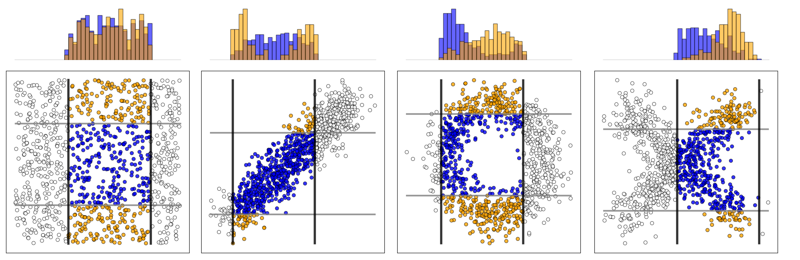

# Monte Carlo Dependency Estimation (MCDE)



Welcome to the supplementary material for the paper [*Monte Carlo Dependency Estimation*](https://arxiv.org/abs/1810.02112) by Edouard Fouché and Klemens Böhm, Karlsruhe Institute of Technology (KIT). 
This repository contains the reference implementation of MCDE/MWP and the information to reproduce the experiments in the paper. 

This repository is released under the AGPLv3 license. Please see the [LICENSE.md](LICENSE.md) file. 

## Quick Start

### Build it and run it

**Requirements** : ([Oracle JDK 8](https://www.oracle.com/technetwork/java/javase/downloads/jdk8-downloads-2133151.html) or [OpenJDK 8](http://openjdk.java.net/install/)) and [sbt](https://www.scala-sbt.org/1.0/docs/Setup.html) 

The project is built with sbt (version 0.13.16). You can compile, package or run the project as follows: 

```
sbt compile
sbt package 
sbt "run <arguments>"
```

You can also export a "fat" jar, including all dependencies and scala libraries using [`sbt-assembly`](https://github.com/sbt/sbt-assembly) (0.11.2):

```
sbt assembly
```

This creates a jar in the folder `target/scala-2.11/` named `MCDE-<version>.jar`, which can be run from java (no 
sbt/scala installation required). The version of the package at the time of the experiments is 1.0.

Once you have built the jar, you can run it as follows: 

```
java -jar target/scala-2.11/MCDE-1.0.jar <arguments>
```

## Command line arguments for MCDE/MWP

The application accepts various arguments. The first two (`-t <task>` and `-f <file>`) are mandatory. Arguments are not case sensitive and can be given in any order. 

- `-t <task>`: Task to perform. Possible choices:
    - `EstimateDependency`: Estimates the dependency of a single subspace (with 2 or more dimensions).
    - `EstimateDependencyMatrix`: Estimates the 2-D dependency matrix, i.e., the dependency of every pairs in the data. 
- `-f <file>`: the path to the data source (a comma-separated text file  with 1 line header) in your system.
- `-a <approach>`: The approach to use for dependency estimation. Possible choices: 
    - MCDE approaches: `MWP`(Default)
    - Benchmark approaches (see II: Related Work): `HiCS`, `TC`, `II`, `MS`, `UDS`, `MAC`, `CMI` 
- `-p <plevel>`: Level of parallelism to use. Possible choices:
    - `0` (Default, running single core)
    - `1` (The number of threads is set by the program automatically)
    - Any integer >1 (The user specifies the number of threads explicitly)
    - Please note that, in the case of:
	    - `EstimateDependency`, the iterations of `MWP` will run in parallel (not supported for benchmark approaches).
	    - `EstimateDependencyMatrix`, coefficients are estimated in parallel (thus, supported for all approches).

Additional argument for `MWP`:

- `-m <M>`: the number of Monte Carlo simulations. More simulations lead to more accurate estimates (see Theorem 4), but also increases runtime linearly. Default: 50

Additional argument for `EstimateDependency`:

- `-d <dimensions>`: Dimensions of the subspace on which the dependency should be estimated (a list of integers, comma-separated, starting from 0). If not specified, the dependency is estimated on the full space. 

## Examples

We provide a sample of the data used for the experiments in `src/test/resources/data` for testing purposes.

### Running MCDE/MWP

- Independent data (2-D)

```bash
fouchee@Modena:~/git/MCDE$ java -jar target/scala-2.11/MCDE-1.0.jar -t EstimateDependency -f src/test/resources/data/Independent-2-0.0.csv -a MWP -m 50 -d 0,1
08:05:41.627 [main] INFO  Main$ - Working directory: /home/fouchee/git/MCDE
08:05:41.725 [main] INFO  Main$ - Raw parameters given: ["-t", "EstimateDependency", "-f", "src/test/resources/data/Independent-2-0.0.csv", "-a", "MWP", "-m", "50", "-d", "0,1"]
08:05:41.809 [main] WARN  Main$ - Parallelism level not specified, running on single core.
08:05:41.854 [main] INFO  Main$ - Usage: -t EstimateDependency -f <file> -a <approach> -m <M> -d <dimensions> -p <plevel>
0.4753742163666849
Data Loading time: 	 76.138745 ms (cpu), 76.460393 ms (wall)
Preprocessing time: 	 32.325762 ms (cpu), 36.009404 ms (wall)
Computation time: 	 37.12567 ms (cpu), 37.323588 ms (wall)
```

- Independent dependency (2-D) 

```bash
fouchee@Modena:~/git/MCDE$ java -jar target/scala-2.11/MCDE-1.0.jar -t EstimateDependency -f src/test/resources/data/Linear-2-0.0.csv -a MWP -m 50 -d 0,1
08:06:10.943 [main] INFO  Main$ - Working directory: /home/fouchee/git/MCDE
08:06:11.033 [main] INFO  Main$ - Raw parameters given: ["-t", "EstimateDependency", "-f", "src/test/resources/data/Linear-2-0.0.csv", "-a", "MWP", "-m", "50", "-d", "0,1"]
08:06:11.112 [main] WARN  Main$ - Parallelism level not specified, running on single core.
08:06:11.153 [main] INFO  Main$ - Usage: -t EstimateDependency -f <file> -a <approach> -m <M> -d <dimensions> -p <plevel>
0.9999998904398533
Data Loading time: 	 72.585293 ms (cpu), 73.281843 ms (wall)
Preprocessing time: 	 31.995782 ms (cpu), 32.164805 ms (wall)
Computation time: 	 35.695044 ms (cpu), 35.812886 ms (wall)
```

###  Computing the 2D-matrix of MCDE/MWP

- Independent data (2-D)

```bash
fouchee@Modena:~/git/MCDE$ java -jar target/scala-2.11/MCDE-1.0.jar -t EstimateDependencyMatrix -f src/test/resources/data/Independent-5-0.0.csv -a MWP -m 50 -p 0
08:06:46.343 [main] INFO  Main$ - Working directory: /home/fouchee/git/MCDE
08:06:46.434 [main] INFO  Main$ - Raw parameters given: ["-t", "EstimateDependencyMatrix", "-f", "src/test/resources/data/Independent-5-0.0.csv", "-a", "MWP", "-m", "50", "-p", "0"]
08:06:46.536 [main] WARN  Main$ - Running with parallelism level: 0
08:06:46.580 [main] INFO  Main$ - Usage: -t EstimateDependencyMatrix -f <file> -a <approach> -m <M> -p <plevel>
0.00	0.53	0.41	0.44	0.43
0.53	0.00	0.55	0.38	0.57
0.41	0.55	0.00	0.43	0.57
0.44	0.38	0.43	0.00	0.58
0.43	0.57	0.57	0.58	0.00
Data Loading time: 	 92.681802 ms (cpu), 92.88746 ms (wall)
Preprocessing time: 	 39.954535 ms (cpu), 39.999726 ms (wall)
Computation time: 	 85.453125 ms (cpu), 86.205151 ms (wall)
```

For larger tables (e.g., with 100 dimensions), parallelism provides a significant runtime imporvement:

- Independent data (100-D, no parallelism)

```bash
fouchee@Modena:~/git/MCDE$ java -jar target/scala-2.11/MCDE-1.0.jar -t EstimateDependencyMatrix -f src/test/resources/data/Independent-100-0.0.csv -a MWP -m 50 -p 0
08:07:14.583 [main] INFO  Main$ - Working directory: /home/fouchee/git/MCDE
08:07:14.670 [main] INFO  Main$ - Raw parameters given: ["-t", "EstimateDependencyMatrix", "-f", "src/test/resources/data/Independent-100-0.0.csv", "-a", "MWP", "-m", "50", "-p", "0"]
08:07:14.961 [main] WARN  Main$ - Running with parallelism level: 0
08:07:15.063 [main] INFO  Main$ - Usage: -t EstimateDependencyMatrix -f <file> -a <approach> -m <M> -p <plevel>
0.00	0.50	0.44	0.48	0.43	0.51	0.57	0.59	0.58	0.53	 ... (truncated)
0.50	0.00	0.50	0.55	0.52	0.59	0.59	0.55	0.55	0.50	 ... (truncated)
0.44	0.50	0.00	0.45	0.44	0.54	0.49	0.44	0.46	0.66	 ... (truncated)
0.48	0.55	0.45	0.00	0.51	0.43	0.54	0.47	0.55	0.35	 ... (truncated)
0.43	0.52	0.44	0.51	0.00	0.51	0.47	0.44	0.53	0.55	 ... (truncated)
0.51	0.59	0.54	0.43	0.51	0.00	0.60	0.56	0.46	0.56	 ... (truncated)
0.57	0.59	0.49	0.54	0.47	0.60	0.00	0.57	0.40	0.43	 ... (truncated)
0.59	0.55	0.44	0.47	0.44	0.56	0.57	0.00	0.45	0.60	 ... (truncated)
0.58	0.55	0.46	0.55	0.53	0.46	0.40	0.45	0.00	0.53	 ... (truncated)
0.53	0.50	0.66	0.35	0.55	0.56	0.43	0.60	0.53	0.00	 ... (truncated)
...	...	...	...	...	...	...	...	...	...
(truncated)
Data Loading time: 	 269.652442 ms (cpu), 280.788656 ms (wall)
Preprocessing time: 	 96.618713 ms (cpu), 96.945092 ms (wall)
Computation time: 	 2596.539562 ms (cpu), 2643.743548 ms (wall)
```

- Independent data (100-D, with parallelism)

```bash
fouchee@Modena:~/git/MCDE$ java -jar target/scala-2.11/MCDE-1.0.jar -t EstimateDependencyMatrix -f src/test/resources/data/Independent-100-0.0.csv -a MWP -m 50 -p 1
08:07:34.170 [main] INFO  Main$ - Working directory: /home/fouchee/git/MCDE
08:07:34.260 [main] INFO  Main$ - Raw parameters given: ["-t", "EstimateDependencyMatrix", "-f", "src/test/resources/data/Independent-100-0.0.csv", "-a", "MWP", "-m", "50", "-p", "1"]
08:07:34.543 [main] WARN  Main$ - Running with default parallelism level.
08:07:34.674 [main] INFO  Main$ - Usage: -t EstimateDependencyMatrix -f <file> -a <approach> -m <M> -p <plevel>
0.00	0.47	0.48	0.41	0.46	0.42	0.49	0.51	0.57	0.50	 ... (truncated)
0.47	0.00	0.62	0.53	0.53	0.51	0.52	0.48	0.52	0.63	 ... (truncated)
0.48	0.62	0.00	0.35	0.42	0.57	0.48	0.49	0.48	0.64	 ... (truncated)
0.41	0.53	0.35	0.00	0.41	0.45	0.50	0.39	0.57	0.42	 ... (truncated)
0.46	0.53	0.42	0.41	0.00	0.53	0.42	0.39	0.51	0.49	 ... (truncated)
0.42	0.51	0.57	0.45	0.53	0.00	0.47	0.49	0.46	0.52	 ... (truncated)
0.49	0.52	0.48	0.50	0.42	0.47	0.00	0.63	0.45	0.44	 ... (truncated)
0.51	0.48	0.49	0.39	0.39	0.49	0.63	0.00	0.55	0.59	 ... (truncated)
0.57	0.52	0.48	0.57	0.51	0.46	0.45	0.55	0.00	0.58	 ... (truncated)
0.50	0.63	0.64	0.42	0.49	0.52	0.44	0.59	0.58	0.00	 ... (truncated)
...	...	...	...	...	...	...	...	...	...
(truncated)
Data Loading time: 	 263.604825 ms (cpu), 275.675212 ms (wall)
Preprocessing time: 	 123.729107 ms (cpu), 123.756542 ms (wall)
Computation time: 	 51.002643 ms (cpu), 1123.108306 ms (wall)
```

## Reproducing the experiments

In this section, we explain how to reproduce the experiments from our paper. 
The experiments creates about 21Mb of data and require about 14 hours 
on a server with 16 cores at 2.2 Ghz, Java Open-JDK 8 and Scala 2.11.8. 
Results are saved in the folder `experiments` as `.csv` files, along with logs.

### Power

Evaluate the statistical power of MCDE/MWP and of the benchmark approaches against a panel of dependencies.
```
sbt "run com.edouardfouche.experiments.Power"  # ~ 6.5 hours, 3Mb data
```

### PowerM

Evaluate the influence of parameter *M* w.r.t. the statistical power of MCDE/MWP. 

```
sbt "run com.edouardfouche.experiments.PowerM" # ~ 8 minutes, 1Mb data
```

### PowerN

Evaluate the sensitivity of each approach w.r.t. *n*, the number data points. 

```
sbt "run com.edouardfouche.experiments.PowerN" # ~ 2.5 hours, 5Mb data
```

### PowerDiscrete

Evaluate the robustness of each approach against discrete data. 

```
sbt "run com.edouardfouche.experiments.PowerDiscrete" # ~ 3 hours, 5Mb data
```

### ScalabilityN

Evaluate the scalability of each approach w.r.t. *n*, the number data points. 

```
sbt "run com.edouardfouche.experiments.ScalabilityN" # ~ 45 minutes, 2Mb data
```

### ScalabilityD

Evaluate the scalability of each approach w.r.t. *d*, the number dimensions. 

```
sbt "run com.edouardfouche.experiments.ScalabilityD" # ~ 1.5 hours, 2Mb data 
```

## Visualize the results

Then, you can use the Jupyter notebooks in folder `visualize` to reproduce 
the plots from the publication. By the time of the experiments, we use the following Python packages: 

```
# Name                    Version               
matplotlib                2.0.2             
numpy                     1.13.1              
pandas                    0.20.3     
seaborn                   0.8           
```

## Contributing

We welcome contributions to the repository and bug reports on GitHub.

For questions and comments, please contact `edouard.fouche@kit.edu`

## Acknowledgements

This repository features code from other projects. We would like to acknowledge the following contributions:

- Hoang Vu Nguyen for providing the source for `HiCS`, `TC`, `II`, `MS`, `UDS`, `MAC`, `CMI` in the [code dump](http://eda.mmci.uni-saarland.de/uds/) for the paper `Nguyen, Hoang-Vu, Panagiotis Mandros, and Jilles Vreeken. "Universal dependency analysis." Proceedings of the 2016 SIAM International Conference on Data Mining. Society for Industrial and Applied Mathematics, 2016.`

- The [ELKI project](https://elki-project.github.io/) for the R*-Tree index structure, that we use to accelerate the nearest neighbors queries in `TC` and `II`. 

- Hendrik Braun, for the implementation of `TC`, `II`, `MS`, as a part of his Bachelor's thesis at KIT. 
